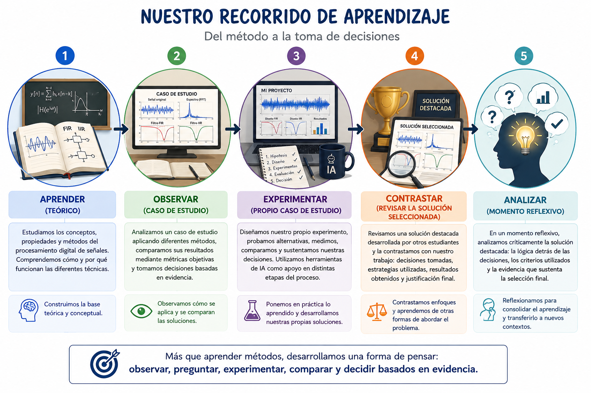

# 🎯 Cierre de la Sección I — Procesamiento Digital de Audio

Querido estudiante:

Hemos culminado la primera sección del curso **Procesamiento Digital de Señales** y, a manera de reflexión, quiero invitarte a mirar por un momento el camino que recorrimos.

Comenzamos **aprendiendo diferentes métodos** para el procesamiento digital de audio (Capitulo 1). Sin embargo, conocer una técnica y saber implementarla no era nuestro objetivo final. Por eso, después analizamos un **caso de estudio**, en el que pudimos observar cómo diferentes alternativas pueden resolver un mismo problema tanto con **filtros digitales** (Capitulo 2) como con **IA** (Capitulo 3) y, sobre todo, cómo sus resultados pueden compararse objetivamente para tomar una decisión.

Luego llegó tu turno (proyecto del primer corte). 🧪 Tuviste que enfrentarte a un problema real, formular hipótesis, diseñar una estrategia, experimentar, comparar alternativas y utilizar los resultados obtenidos para sustentar tus decisiones. Y tuviste que enfrentarte a preguntas como: **qué hacer, cómo organizar el experimento, qué comparar y cómo interpretar los resultados**.

Después de haber construido tu propia solución, pudiste conocer una **solución destacada desarrollada por otros estudiantes**. Su propósito no es mostrarte *la solución correcta*, porque un problema de ingeniería puede tener diferentes formas de ser abordado. La invitación es a contrastarla con tu propio trabajo: identificar qué hicieron diferente, qué decisiones tomaron, qué evidencias utilizaron y qué elementos podrías incorporar en futuros experimentos.

Finalmente, el pequeño **quiz** te permitió volver sobre esa solución, pero esta vez desde una mirada crítica: no para recordar valores o fragmentos de código, sino para comprender la lógica que existe detrás de las decisiones tomadas.

---

## 🔄 Nuestro recorrido

  <em>Figura. Nuestro recorrido de aprendizaje en la Sección I: del método a la toma de decisiones.</em>

---

Espero que al terminar la Sección I - Audio, te lleves algo más que un conjunto de métodos para procesar señales de audio. Me interesa que empieces a desarrollar una forma de enfrentarte a los problemas: **observar antes de decidir, formular preguntas, experimentar, comparar y dejar que la evidencia te ayude a escoger el camino.**

En la siguiente sección cambiaremos las señales de audio por **Imágenes** y aparecerán nuevos métodos y nuevos problemas. Pero hay algo que no debería cambiar:

> **Antes de preguntarte qué método utilizar, pregúntate qué problema quieres resolver, cómo puedes comprobar que tu solución funciona y qué evidencia necesitas para sustentar tu decisión.**

Nos vemos en la **Sección II: Procesamiento Digital de Imágenes**. 🖼️
