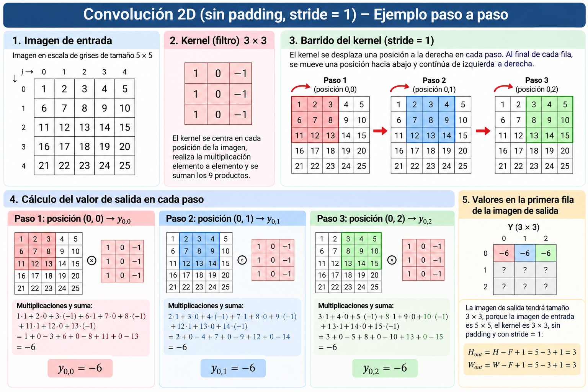
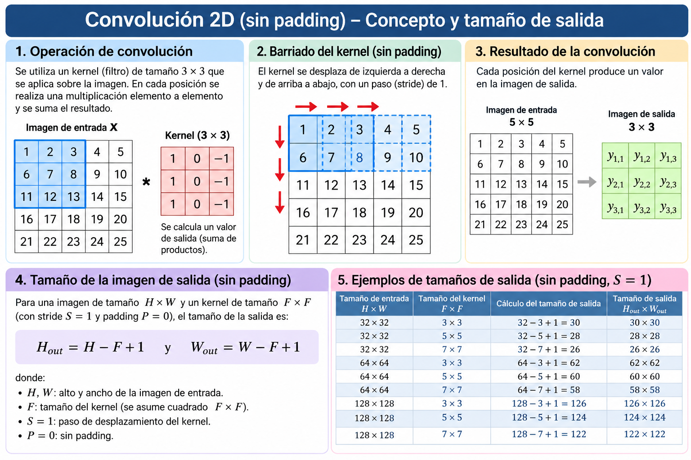
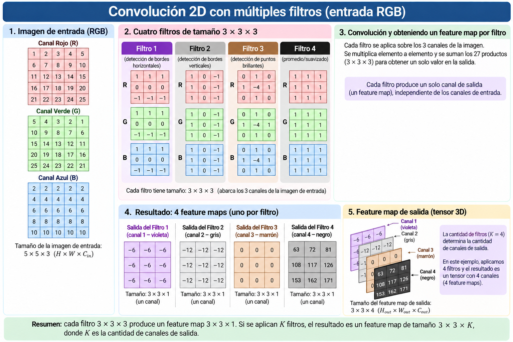
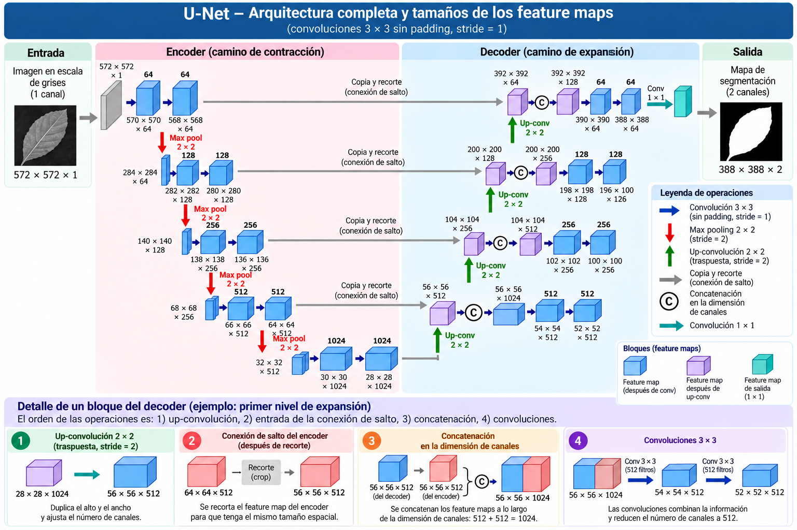

# 🧠 Actividad: De la convolución 2D a U-Net

## 🎯 Objetivo

Comprender cómo las operaciones de **convolución** modifican las dimensiones espaciales y el número de canales de una imagen o *feature map*, para posteriormente **interpretar la arquitectura U-Net a partir del flujo de información y de las dimensiones de sus tensores**.

---

# 1. Convolución 2D: ¿cómo se genera un píxel de salida?

Observa la **Figura 1. Convolución 2D con un filtro**.

  

Considera una imagen de entrada de $5\times5$, un kernel de $3\times3$, sin *padding* y con *stride* $S=1$.

## ✏️ Actividad 1

1. Identifica los **nueve píxeles** utilizados para calcular el primer valor de salida.
2. Realiza las nueve multiplicaciones entre los píxeles de la imagen y los coeficientes del kernel.
3. Suma los nueve resultados.
4. Desplaza el kernel **una posición hacia la derecha** y repite el procedimiento.
5. Explica qué significa utilizar un **stride de 1**.
6. Después de terminar la primera fila, indica dónde debe ubicarse el kernel para continuar el barrido.

### 💭 Pregunta de análisis

> ¿Por qué un kernel de $3\times3$ no puede centrarse sobre los píxeles del borde cuando no se utiliza *padding*?

---

# 2. ¿Qué tamaño tendrá la imagen resultante?

Observa la **Figura 2. Convolución sin padding: tamaño de salida**.

  

Para una entrada de dimensiones $H\times W$, kernel $F\times F$, *padding* $P=0$ y *stride* $S=1$:

$$
H_{\text{out}}=H-F+1
$$

$$
W_{\text{out}}=W-F+1
$$

## ✏️ Actividad 2

Sin realizar la convolución, determina el tamaño de salida:

| Entrada | Kernel | Salida |
|:---:|:---:|:---:|
| $32\times32$ | $3\times3$ | ? |
| $32\times32$ | $5\times5$ | ? |
| $32\times32$ | $7\times7$ | ? |
| $64\times64$ | $3\times3$ | ? |
| $128\times128$ | $5\times5$ | ? |

### 💭 Analiza

Si se aplican consecutivamente **dos convoluciones $3\times3$**, sin *padding* y con *stride* 1:

> ¿Cuántos píxeles se pierden en total en cada dimensión?

---

# 3. De una imagen a múltiples *feature maps*

Observa la **Figura 3. Convolución 2D con múltiples filtros**.

  

Hasta ahora hemos utilizado un solo filtro. Analiza qué ocurre cuando se utilizan **varios filtros** sobre una misma entrada.

Considera una imagen RGB:

$$
X\in\mathbb{R}^{5\times5\times3}
$$

## ✏️ Actividad 3

Responde:

1. ¿Cuántos canales tiene la imagen de entrada?
2. Si el kernel espacial es de $3\times3$, ¿por qué cada filtro tiene dimensiones

$$
3\times3\times3?
$$

3. ¿Cuántos canales de salida produce **un filtro**?
4. Si se utilizan **4 filtros**, ¿cuántos *feature maps* se generan?
5. Determina las dimensiones completas de la salida.

Completa:

$$
5\times5\times3
\xrightarrow[\text{4 filtros}]{3\times3}
\boxed{\quad ?\times ?\times ?\quad}
$$

---

## 🔎 Generalización

Para una entrada:

$$
H\times W\times C_{\text{in}}
$$

y $K$ filtros de tamaño espacial $F\times F$:

### Tamaño de cada filtro

$$
\boxed{F\times F\times C_{\text{in}}}
$$

### Número de canales de salida

$$
\boxed{C_{\text{out}}=K}
$$

### 💭 Pregunta clave

> ¿El número de canales de salida depende del número de canales de entrada o del número de filtros utilizados? Justifica tu respuesta.

---

# 4. 🚀 El reto: interpretemos U-Net

Observa ahora la **Figura 4. Arquitectura U-Net**.

  

> **No busques todavía una descripción de la arquitectura.**
>
> Utiliza únicamente lo aprendido en las actividades anteriores para interpretar las dimensiones mostradas en la figura.

---

# 4.1. Camino de contracción — Encoder

La entrada de la red es:

$$
572\times572\times1
$$

Analiza cómo se obtiene la siguiente secuencia:

$$
572\times572\times1
\rightarrow
570\times570\times64
\rightarrow
568\times568\times64
$$

Para **cada convolución**, determina:

- dimensiones de entrada;
- tamaño de cada filtro;
- cantidad de filtros;
- dimensiones de salida.

---

## Max Pooling

Analiza ahora la operación:

$$
568\times568\times64
\xrightarrow{\text{Max Pooling }2\times2}
284\times284\times64
$$

Responde:

1. ¿Qué ocurre con el alto del *feature map*?
2. ¿Qué ocurre con el ancho?
3. ¿Qué ocurre con el número de canales?

Continúa realizando el mismo análisis para los siguientes niveles del encoder hasta llegar a:

$$
32\times32\times512
$$

---

## Cuello de botella

Explica cómo se obtiene:

$$
32\times32\times512
\rightarrow
30\times30\times1024
\rightarrow
28\times28\times1024
$$

Para cada convolución determina:

- tamaño de los filtros;
- cantidad de filtros utilizados;
- dimensiones del *feature map* resultante.

### 💭 Analiza

Durante el descenso por U-Net:

> ¿Qué ocurre progresivamente con la **resolución espacial**?

> ¿Qué ocurre progresivamente con el **número de canales**?

---

# 4.2. Camino de expansión — Decoder

Parte del cuello de botella:

$$
28\times28\times1024
$$

Después de la *up-convolution* se obtiene:

$$
28\times28\times1024
\rightarrow
56\times56\times512
$$

Desde el encoder llega, mediante una **conexión de salto**, un *feature map* de:

$$
64\times64\times512
$$

Este *feature map* se recorta para obtener:

$$
56\times56\times512
$$

## ✏️ Actividad 4

Responde:

1. ¿Por qué es necesario recortar el *feature map* proveniente del encoder?
2. ¿Qué información llega desde el decoder?
3. ¿Qué información llega mediante la conexión de salto?
4. ¿Qué significa **concatenar** ambos *feature maps*?

---

## Concatenación

Se tienen dos tensores:

$$
56\times56\times512
$$

y

$$
56\times56\times512
$$

que se concatenan en la dimensión de los canales:

$$
56\times56\times512
\;\oplus\;
56\times56\times512
=
\boxed{\quad ?\times ?\times ?\quad}
$$

### 💭 Explica

> ¿Por qué la concatenación modifica el número de canales pero no modifica el alto ni el ancho?

---

## Convoluciones después de la concatenación

Analiza ahora:

$$
56\times56\times1024
\rightarrow
54\times54\times512
\rightarrow
52\times52\times512
$$

Para cada convolución determina:

- tamaño de cada filtro;
- profundidad de cada filtro;
- número de filtros utilizados;
- dimensiones de salida.

---

# 5. 🧩 Ahora sí: explica U-Net

A partir del análisis realizado, construye con tu grupo una explicación de la arquitectura **U-Net**.

La explicación debe responder:

### 1. ¿Qué ocurre con la información durante el encoder?

Considera:

- la resolución espacial;
- el número de canales.

### 2. ¿Qué ocurre durante el decoder?

Explica cómo se recupera progresivamente la resolución espacial.

### 3. ¿Por qué U-Net utiliza conexiones de salto (*skip connections*)?

Explica qué información permiten recuperar y por qué puede ser importante para un problema de **segmentación de imágenes**.

---

# 6. 🎯 De los *feature maps* a la segmentación

Finalmente, analiza la última operación:

$$
388\times388\times64
\xrightarrow{\text{Conv }1\times1}
388\times388\times2
$$

Responde:

1. ¿Por qué una convolución $1\times1$ no modifica las dimensiones espaciales?
2. ¿Cuántos filtros $1\times1$ se utilizaron?
3. ¿Qué profundidad debe tener cada filtro?
4. ¿Qué representan los **2 canales de salida** si se quiere segmentar una hoja respecto al fondo?

---

# 🏁 Conclusión del reto

Completa **con tus propias palabras**:

> **U-Net transforma una imagen en una máscara de segmentación mediante**
>
> ______________________________________________________________________
>
> **mientras que las conexiones de salto permiten**
>
> ______________________________________________________________________

---

## 🌿 Aplicación al proyecto

Relaciona finalmente la arquitectura analizada con el proyecto de **segmentación de hojas de café**.

Explica:

- cuál sería la imagen de entrada;
- qué información debería aprender el encoder;
- por qué es importante conservar información espacial;
- qué representaría la salida de la red;
- cómo podría convertirse la salida en una **máscara binaria hoja/fondo**.
